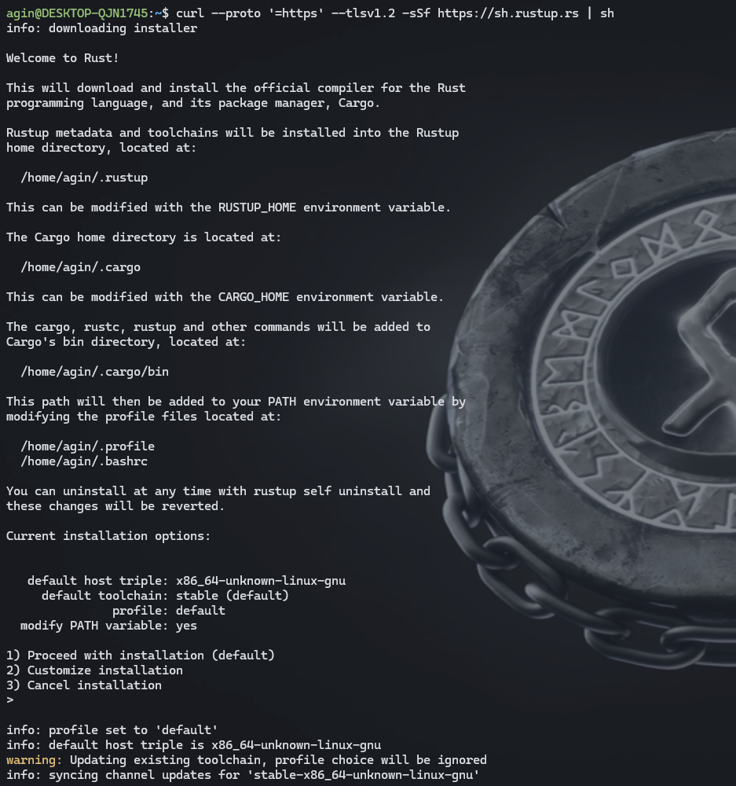
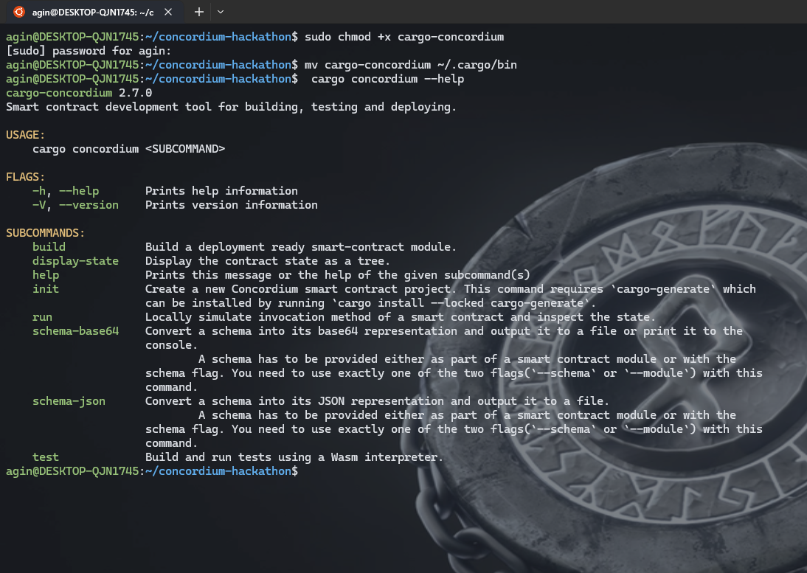
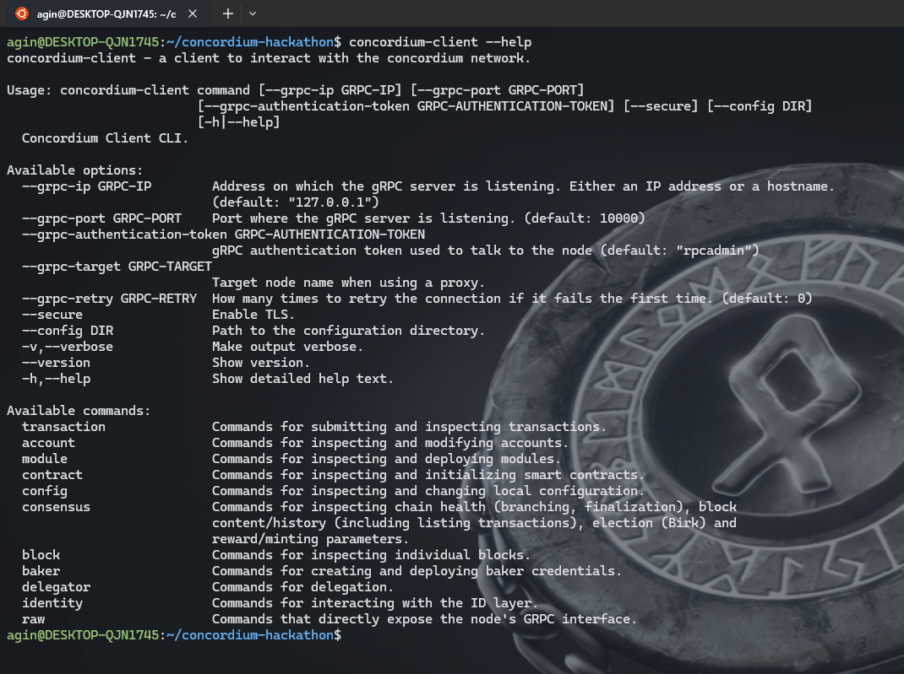
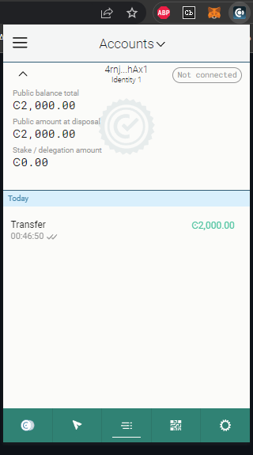
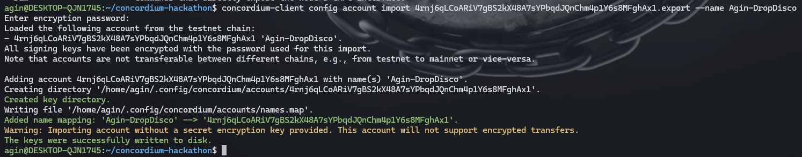

# TASK 1: Setup Development Environment

## Install Rust 

<p align="center">

</p>


## Install cargo-concordium
- Install the package here [LINK](https://developer.concordium.software/en/mainnet/net/installation/downloads-testnet.html#cargo-concordium-testnet)
- Move the package to your path 
```
chmod +x concordium-client
mv cargo-concordium ~/.cargo/bin
```

<p align="center">

</p>


## Install Concordium-client
- Instal package concordium client [LINK](https://developer.concordium.software/en/mainnet/net/installation/downloads-testnet.html#concordium-node-and-client-download-testnet)
- Move the package to your path. see "Install cargo-concordium"
<p align="center">

</p>


## Install the Web Wallet /Extensions,  Create a Testnet account and Acquiring testnet CCD via the CCD faucet
- Download here [LINK](https://chrome.google.com/webstore/detail/concordium-wallet/mnnkpffndmickbiakofclnpoiajlegmg?hl=en-US)
<p align="center">

</p>


## Export the account from web wallet
<p align="center">

</p>
